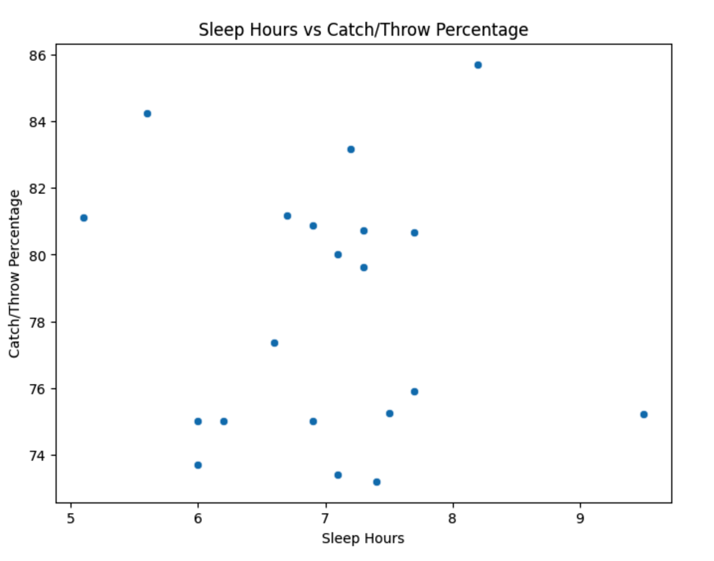
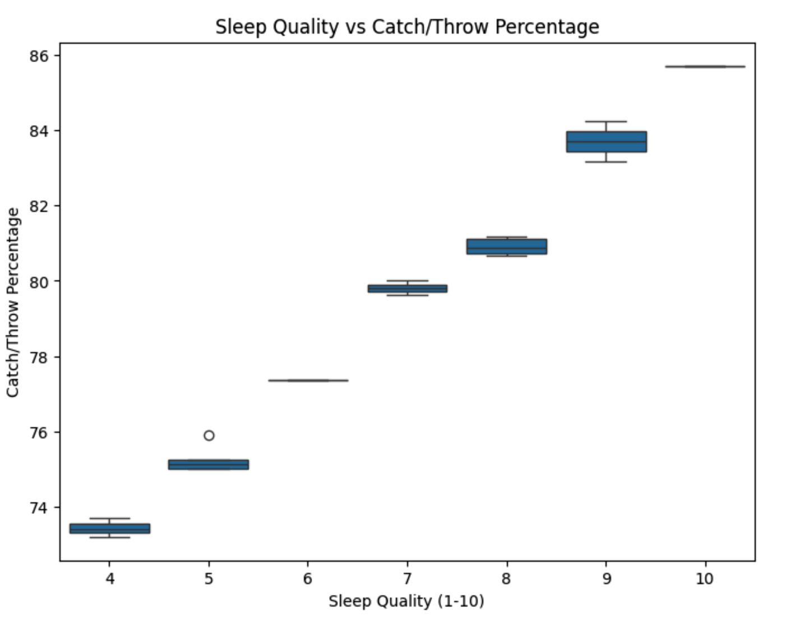
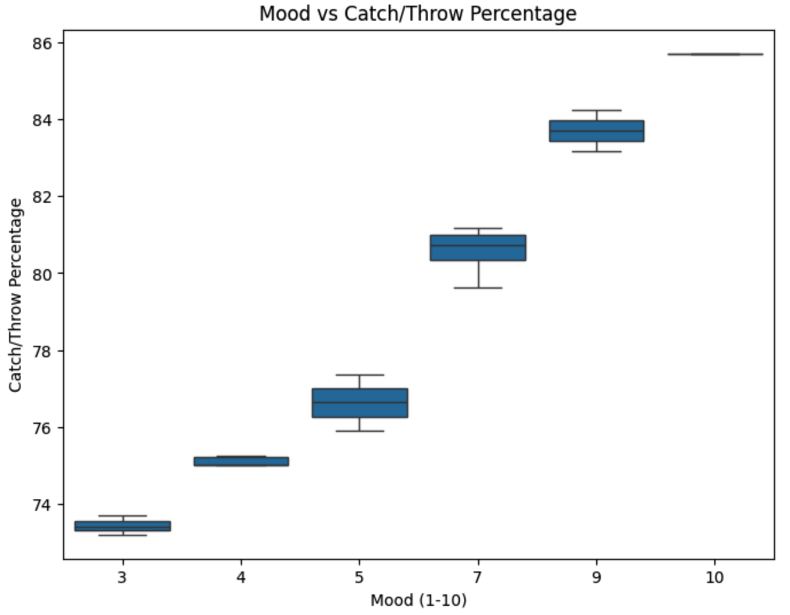
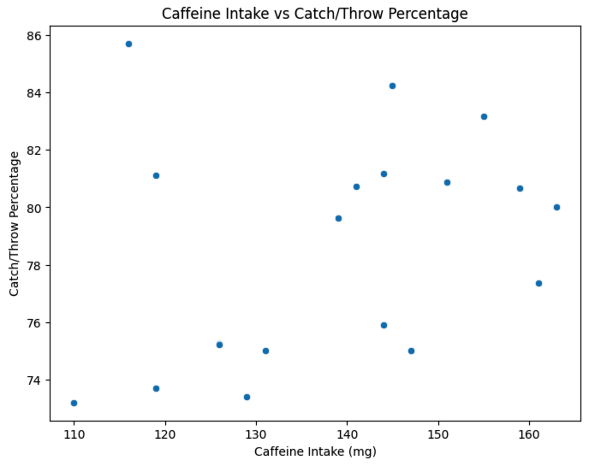
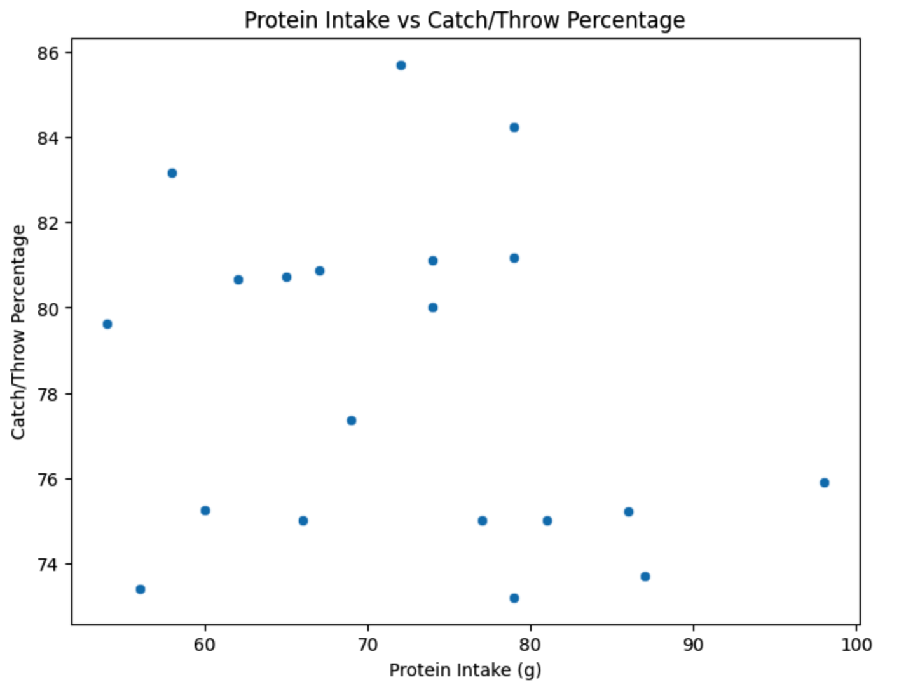
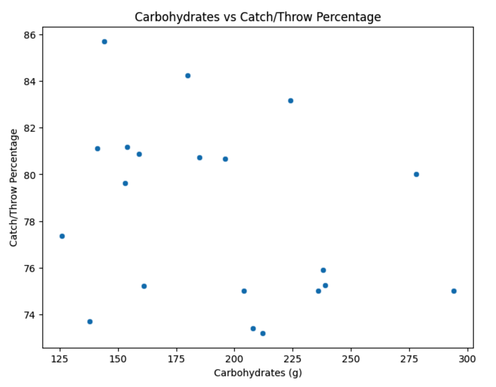
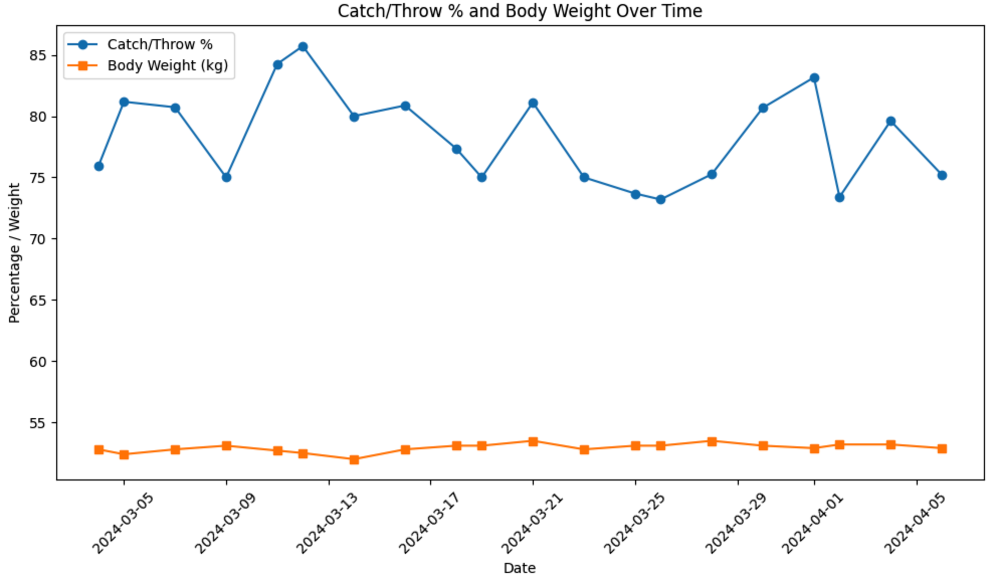

# Ultimate Frisbee Training Performance Analysis

## Project Overview

Over the course of several ultimate frisbee training sessions, I will explore how my daily habits and physical/mental conditions impact my catch and throw performance. The aim is to identify which lifestyle, nutritional, and psychological factors influence performance the most. Through structured data analysis, I hope to uncover patterns and make data-driven adjustments to optimize training results.

The plan is simple: track relevant factors daily, correlate them with training outcomes, and test hypotheses regarding their influence. Ultimately, this project is about transforming data into insights that can help refine my approach to athletic development.

## Objectives

### Understand Performance Influencers
Analyze how attributes such as sleep quality, caffeine intake, mood, body weight, and nutrition affect ultimate frisbee performance.

### Identify Key Factors
Pinpoint the most influential variables and develop a personalized strategy to improve accuracy and catching percentage.

### Data-Driven Optimization
Apply insights from the data to fine-tune routines for more consistent and measurable improvements.

### Apply Data Science Skills
Integrate methods from data analysis and statistics to explore real-life applications in a structured way.

## Motivation

This project combines my interests in ultimate frisbee and data science. Here’s why it matters:

**Personal Growth**  
Understanding how my habits impact physical performance helps me grow as an athlete and individual.

**Scientific Approach**  
Rather than relying on guesswork, this project lets me approach training systematically, using evidence-based decisions.

**Practical Application**  
This is an opportunity to apply concepts learned in my data science coursework to a passion project that directly impacts my athletic development.

**Long-Term Impact**  
The insights gained won’t just help my frisbee performance—they will provide a framework I can use for other performance-driven goals.

## Dataset

This dataset contains multiple records from my training sessions and includes the following attributes:

- **Date**: The date of each training session  
- **Sleep Hours**: Total hours slept the night before  
- **Sleep Quality**: Self-rated sleep quality (scale: 1–10)  
- **Caffeine (mg)**: Amount of caffeine consumed before training  
- **Mood (1-10)**: Self-rated psychological state before training  
- **Training Difficulty**: Self-rated session difficulty (scale: 1–10)  
- **Protein (g)**: Protein consumed that day  
- **Carbohydrates (g)**: Carbohydrate intake that day  
- **Body Weight (kg)**: Measured weight on the day of training  
- **CatchThrow_Percentage**: Primary performance indicator

## Tools and Technologies

- **Python**: Core analysis language
- **Pandas**: For loading, cleaning, and transforming the dataset
- **Matplotlib & Seaborn**: To generate visualizations
- **Statsmodels & SciPy**: For statistical testing and regression modeling
- **Excel**: Initial data logging and preprocessing

## Analysis Plan

### Data Collection
- Manually record each session’s values in Excel or Google Sheets
- Maintain consistent formats for smooth import into Python

### Data Cleaning & Preprocessing
- Convert time/date columns
- Normalize units (e.g., caffeine in mg, nutrients in grams)
- Handle missing or incomplete values with mean imputation

### Visualization
- **Heatmaps**: Show overall correlations between variables
- **Scatter Plots**: Show linear/non-linear relationships (e.g., caffeine vs performance)
- **Boxplots**: Show performance trends across different sleep/mood groups
- **Time Series Plots**: Track performance progression and weight stability

### Hypothesis Testing
- **H₀:** None of the measured attributes significantly affect performance  
- **H₁:** At least one or more attributes have a measurable influence

Statistical significance will be assessed using Pearson correlation and p-values (α = 0.05). Regression models will test the predictive strength of each variable.

### Trend Analysis
- Look for performance trends across training days
- Evaluate fluctuations in body weight, mood, or sleep against performance changes
- Compare performance on high vs. low difficulty training sessions

### Example Analysis
- Plot: Mood vs CatchThrow_Percentage (expect positive trend)
- Plot: Caffeine (mg) vs CatchThrow_Percentage (expect curved/U-shaped relation)
- Plot: Body Weight vs CatchThrow_Percentage (expect minimal effect)

## Key Visualizations

### Sleep Hours vs Catch/Throw %

### Sleep Quality vs Catch/Throw %

### Mood vs Catch/Throw %

### Caffeine Intake vs Catch/Throw %

### Protein Intake vs Catch/Throw %

### Carbohydrates vs Catch/Throw %

### Training Difficulty vs Catch/Throw %

### Body Weight and Catch/Throw % Over Time

## Conclusion (To Be Finalized Post-Analysis)

By the end of this project, I aim to answer:
- Which variables most strongly influence ultimate frisbee performance?
- Are small changes in mood, nutrition, or sleep enough to shift performance metrics?
- How can I optimize training and recovery using these findings?

The broader goal is not just better frisbee sessions—but a clearer understanding of how daily habits and measurable choices affect physical output in any discipline.

